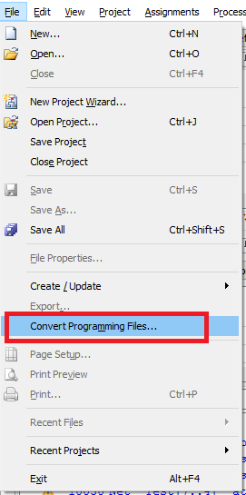
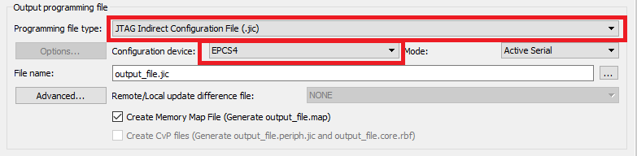
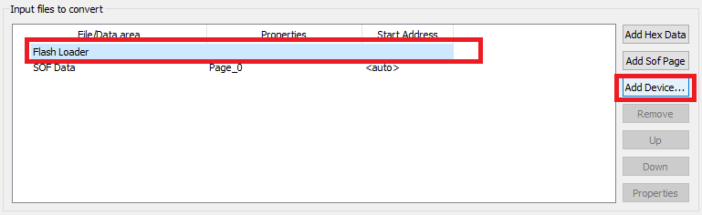
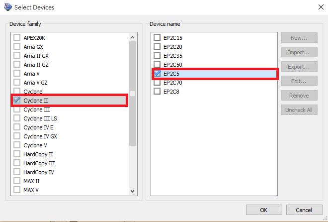

Quantus II project for FPGA
===
Hsiou-Yuan Liu, Chung-You Shih

Overview
---
- The latest version of Quantus II web edition that supports Cyclon II is [13.0sp1](http://dl.altera.com/13.0sp1/?edition=web).
- Loading the program to the FPGA
- [advanced] Modifying the number of pulses for each channel, as well as the number of channels

Loading the program to the FPGA
---
1. Double click waveformGen.qpf
2. If you do not modify the Quartus II project, it should be compiled. You then proceed to the next step. Otherwise compile the project through clicking "start compilation"  

3. Open the "Convert Programming Files" window  

4. Select the Programming file type to JTAG Indirect Configuration (`.jic`) file. Configuration device selected to EPCS4.  

5. Left click Flash Loader item; then left click "Add Device"  

6. Select the check boxes as those in the figure  

7. Left click SOF Data item, and then left click Add File  
8. Select the sof file  
9. Left click `waveformGen.sof` item; left click Properties.  
10. mark the Compression box (if there is any problem regarding auto-loading, ignore steps 6 & 7 and redo)  
11. It now should look like this (figure in next slide). Then click Generate button.  
12. open the Programmer window  
13. Clean up the content of right-hand side table  
14. Connect the blaster and the click “Hardware Setup.”  
15. Click USB-Blaster and then click Close  
16. Click “Add File” and choose the only `.jic` file.   
17. mark the checkboxes as those in the figure; click Start.  
18. Finally, you have to turn off the FPGA and then turn it on again.The program written onto the EPROM through .jic will be loaded to the FPGA automatically every time you turn on the FPGA.

[advanced] Modifying the number of pulses for each channel, as well as the number of channels
---
1. Open "table.txt" in subforder "VerilogGen"
2. Specify the number of pulses for each channel. The number of channels is equal to how many numbers you specify in table.txt
3. If you enter the numbers as the figure, it turns out to be:
 - 0th channel with 16 impulses (32 transition edge),
 - 1st with 16
 - 2nd with 16
 - 3rd with 8
 - 4th with 16
 - 5th with 32.
4. Then run the python script `make.py` by simply double clicking the `make.bat`.
5. `log.txt` provides what has been done in the last operation.
6. Open the Quartus II project, recompile it, and burn the file onto the FPGA through the USB blaster.

Commands
---
The overall behavior of this module was divided into two parts, the communication and waveform generation.
For communication, 8 commands are provided:

|          Name          |    Description                                                  |    Cmd Byte    |
|:----------------------:|-----------------------------------------------------------------|----------------|
|      M_SET_PERIOD      | Set the repeat period                                           |    0x01        |
|      M_SET_CH_WAVE     | Set the waveform data to a channel                              |    0x02        |
|      M_SET_CH_INIT     | Set the initial value of a channel                              |    0x03        |
|      M_SET_CH_VAL      | Force the value of a channel to the setting value               |    0x04        |
|     M_SET_SPL_RATE     | Set the sampling rate of analog output                          |    0x05           |
|        M_CMD_ARM       |Arm the system                                                   |    0x80        |
|      M_CMD_TO_INIT     |Force the value of all channels to their initial values          |    0x81        |
|    M_CMD_RESET_TIME    |Force the time counter reset to 0                                |    0x82        |
|     M_CMD_RESET_DEV    |Reset the device                                                 |    0xFF        
If you send those above when the communication state is in idle state, the state will transfer to corresponding state. Note that if the state is not idle, the time counter is reset to 0. Next I gave the usage of each command.

- M_SET_PERIOD:
```
0x01/
PERIOD[31:24]/ PERIOD[23:16]/ PERIOD[15:8]/ PERIOD[7:0]/
0x00
```
- M_SET_CH_WAVE
```
0x02/
{
CHANNEL_ID/
NUM[15:8]/ NUM[7:0]/
{
TIME[31:24]/ TIME[23:16]/ TIME[15:8]/ TIME[7:0]/
}*NUM   [if NUM is zero, then skip to next CHANNEL_ID]
}*n      [n is an arbitrary number]
0xFF/    [where 0xFF means the 255th channel, which is prohibited]
0x00
```
- M_SET_CH_INIT
```
0x03/
{
CHANNEL_ID/ VALUE    [VALUE could only be 0x00 or 0x01]
}*n
0xFF    [where 0xFF means the 255th channel, which is prohibited]
0x00
```
- M_SET_CH_VAL
```
0x04/
{
CHANNEL_ID/ VALUE    [VALUE could only be 0x00 or 0x01]
}*n
0xFF    [where 0xFF means the 255th channel, which is prohibited]
0x00
```
- M_CMD_ARM
```
0x80/ 0x00/ 0x00
```
- M_SET_SPL_RATE
```
0x05/SPL_RATE/0x00    [50Mhz/(SPL_RATE*2*10) is the sampling rate of analog output]
```
- M_CMD_TO_INIT
```
0x81/ 0x00/ 0x00
```
- M_CMD_RESET_TIME
```
0x82/ 0x00/ 0x00
```
- M_CMD_RESET_DEV
```
0xFF/ 0x00/ 0x00
```
